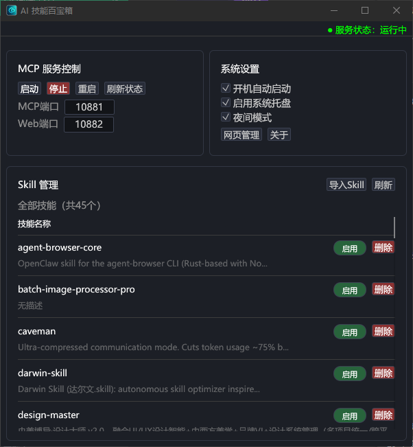

# AI 技能百宝箱 (AISkillBox)

[English](README.en.md) | [简体中文](README.zh-CN.md)

> 给普通用户的 Skill 管理工具，让管理 AI 技能像用手机一样简单。

## 这是什么？

你有很多 AI 技能（Skill）文件，散落在各个文件夹里，找不到、管不了、容易丢。

**AISkillBox 帮你：**
- 一键扫描所有技能
- 可视化管理（启用/禁用/删除）
- 误删了？回收站一键恢复
- 找不到？搜索一下就出来

## 给谁用的？

| 用户 | 场景 |
|------|------|
| AI 初学者 | 刚接触 Cursor/Claude，不知道怎么管理技能 |
| 技能收藏者 | 收藏了几十个技能，找不到、管不过来 |
| 普通用户 | 不想改代码，只想点点鼠标管理技能 |

## 3 步开始

> ✅ 无需安装 Python/Node，无需修改任何代码，双击即可运行

1. **下载解压**
2. **双击运行** `AISkillBox-mcp.exe`
3. **配置连接**（在任意 AI 编辑器中添加 MCP）

就这么简单。

## 界面预览



## 它能做什么？

### 扫描技能
```
你的 skills/ 文件夹
    ↓ 自动扫描
AISkillBox 列出所有技能
    ↓ 自动注册
AI 助手可以使用这些技能
```

### 管理技能

| 操作 | 说明 |
|------|------|
| 启用 | 让 AI 助手可以使用这个技能 |
| 禁用 | 暂时不让 AI 用这个技能 |
| 删除 | 不要了？先进回收站（不会丢失，AI 无法调用，放心操作） |
| 恢复 | 删错了？回收站一键恢复 |
| 搜索 | 关键词/标签快速找到 |

### 三种管理方式

| 方式 | 适合谁 |
|------|--------|
| **AI 对话**（推荐） | 对 AI 说"列出所有技能"就行 |
| **桌面客户端** | 双击打开，点点鼠标 |
| **Web 后台** | 浏览器打开，随时随地 |

## 怎么配置？

在任意 AI 编辑器（Cursor/Claude/Zed/Windsurf 等）的 `mcp.json` 中添加：

```json
{
  "mcpServers": {
    "skill-manager": {
      "url": "http://127.0.0.1:10881/mcp"
    }
  }
}
```

配置完成后，对 AI 说"列出所有技能"测试一下。

## 它和其他工具有什么不同？

| 对比项 | 其他工具 | **AISkillBox** |
|--------|---------|----------------|
| 需要编程 | ✅ 要改代码 | ❌ 点点鼠标 |
| 可视化 | ❌ 命令行 | ✅ GUI + Web |
| 回收站 | ❌ 删了就没了 | ✅ 误删可恢复 |
| 搜索 | ❌ 手动找 | ✅ 关键词搜索 |
| 批量操作 | ❌ 一个个来 | ✅ 批量管理 |
| 跨编辑器 | ❌ 绑定单一编辑器 | ✅ 一次配置，全编辑器通用 |

## 程序文件

| 文件 | 说明 |
|------|------|
| `AISkillBox-mcp.exe` | 主程序（端口 10881 + Web 后台 10882） |
| `AISkillBox.exe` | 桌面管理客户端 |

## 目录结构

```
AISkillBox/
├── skills/           # 你的技能文件夹
├── skill-trash/      # 回收站（删掉的技能）
├── skills.db         # 数据库（自动管理）
├── config.toml       # 配置文件（一般不用改）
└── web-admin/        # Web 管理后台
```

---

<details>
<summary>技术细节（点击展开）</summary>

### MCP 工具

| 工具名 | 说明 |
|--------|------|
| `list_skills` | 列出所有技能 |
| `search_skills` | 搜索技能 |
| `enable_skill` | 启用技能 |
| `disable_skill` | 禁用技能 |
| `delete_skill` | 删除技能（进回收站） |
| `restore_skill` | 从回收站恢复 |
| `refresh_skills` | 刷新技能列表 |

### 配置文件

```toml
listen_addr = "127.0.0.1:10882"
mcp_listen_addr = "127.0.0.1:10881"
```

### 设计理念

1. **工具宁缺毋滥**：只做真正需要的功能，不堆砌
2. **记忆只蒸馏不堆砌**：只保留有价值的信息，不重复存储
3. **对话式运维**：通过 AI 对话管理，比 GUI 更高效
4. **本地优先**：所有数据存储在本地，不依赖外部服务
5. **零依赖**：双击即可运行，无需安装任何环境
6. **跨编辑器通用**：一次配置，Cursor/Claude/Zed 等任意编辑器都能用

</details>

---

## 开源协议

Copyright (c) Mr_老鬼. All rights reserved.

允许自由使用、修改和分发，但**必须保留原始版权声明和出处链接**。

如需商用或二次开发，请联系作者获取授权：QQ 1156346325 / 网站 https://www.junjiestudio.top

---

## 技术栈

### 核心技术

| 技术 | 用途 |
|------|------|
| **Rust** | 主语言，高性能、内存安全 |
| **rmcp** | MCP 协议官方 SDK（适配 2026-07 无状态 MCP 规范） |
| **SQLite** | 本地数据持久化 |
| **Tokio** | 异步运行时 |
| **Axum** | HTTP 框架 |
| **egui** | 桌面 GUI |

### 架构

```
┌─────────────────────────────────────────┐
│              AISkillBox                 │
├─────────────────────────────────────────┤
│  MCP Server (端口 10881)               │
│  └─ rmcp SDK + Streamable HTTP         │
├─────────────────────────────────────────┤
│  Web Admin (端口 10882)                 │
│  └─ Axum + 静态文件服务                 │
├─────────────────────────────────────────┤
│  Desktop GUI                            │
│  └─ egui + eframe                      │
├─────────────────────────────────────────┤
│  数据层                                 │
│  └─ SQLite (skills.db)                 │
└─────────────────────────────────────────┘
```

### 目录结构

```
AISkillBox/
├── skills/           # 技能文件夹（用户存放）
│   ├── easyclick-android/
│   │   └── SKILL.md
│   └── ...
├── skill-trash/      # 回收站
├── skills.db         # SQLite 数据库
├── config.toml       # 配置文件
├── tools/            # 内置工具定义
└── web-admin/        # Web 管理后台
```

### 编译

```bash
# 安装 Rust
curl --proto '=https' --tlsv1.2 -sSf https://sh.rustup.rs | sh

# 克隆项目
git clone https://github.com/Mr-老鬼/AISkillBox.git
cd AISkillBox

# 编译 Release
cargo build --release

# 输出位置
# target/release/AISkillBox-mcp.exe
# target/release/AISkillBox.exe
```

### 依赖清单

```toml
[dependencies]
rmcp = "2.0"           # MCP 协议
tokio = "1"            # 异步运行时
axum = "0.8"           # HTTP 框架
rusqlite = "0.37"      # SQLite
serde = "1"            # 序列化
figment = "0.10"       # 配置
tracing = "0.1"        # 日志
walkdir = "2"          # 目录遍历
yaml-rust2 = "0.11"    # YAML 解析
eframe = "0.33"        # GUI 框架
```

---

**Author: Mr_老鬼** | QQ: 1156346325 | B站: Mr_老鬼 | Website: https://www.junjiestudio.top
